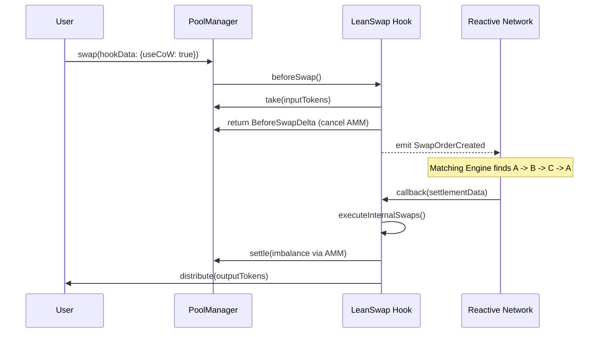

# LeanSwap: Coincidence of Wants (CoW) on Uniswap v4

[](https://book.getfoundry.sh/)
[](https://soliditylang.org/)
[](https://opensource.org/licenses/MIT)

**LeanSwap** is a decentralized exchange optimization layer built as a [Uniswap v4 Hook](https://docs.uniswap.org/concepts/v4-overview/hooks). It implements **Coincidence of Wants (CoW)** matching to allow users to swap assets directly with each other, bypassing the Automated Market Maker (AMM) when matching liquidity is available. This reduces slippage, eliminates AMM fees, and protects users from MEV (Maximal Extractable Value).

---

## 📖 Table of Contents

- [Overview](#-overview)
- [How It Works](#-how-it-works)
- [Architecture](#-architecture)
- [Project Structure](#-project-structure)
- [Getting Started](#-getting-started)
- [Testing](#-testing)
- [Deployment](#-deployment)
- [Next Steps](#-next-steps)
- [License](#-license)

---

## 🌟 Overview

Standard AMM swaps often incur slippage and fees, even if another user is trying to make the exact opposite trade at the same time. LeanSwap intercepts these trades using Uniswap v4's `beforeSwap` hook.

If a user opts into CoW, their trade is "held" in a virtual order book. A **Reactive Smart Contract (RSC)** monitors these orders and triggers a settlement when a match or a multi-party cycle (e.g., A → B → C → A) is found.

### Key Benefits
- **Zero Slippage:** Peer-to-peer matches execute at a fixed price.
- **Gas Efficiency:** Multi-party cycles settle in a single transaction.
- **MEV Protection:** Trades don't hit the public mempool in a way that can be front-run on the AMM.
- **Atomic Settlement:** If a match fails, the system can fallback to the AMM or wait for the next match.

---

## ⚙️ How It Works

### 1. The Hook Interception
When a user initiates a swap through the Uniswap v4 `PoolManager`, the LeanSwap hook's `beforeSwap` function is triggered:
- **Opt-in:** The hook checks the `hookData` for a `useCoW` flag.
- **Taking Funds:** If enabled, the hook uses `poolManager.take()` to move the user's input tokens into the hook contract.
- **Zeroing the AMM:** The hook returns a `BeforeSwapDelta` that matches the input amount, effectively "canceling" the swap execution on the Uniswap AMM so no price impact occurs.
- **Event Emission:** A `SwapOrderCreated` event is emitted.

### 2. The Reactive Matchmaker
A `LeanSwapReactive.sol` contract sits on the [Reactive Network](https://reactive.network/) and listens for these events:
- **Detection:** It maintains an off-chain/cross-chain state of pending orders.
- **Matching:** It searches for direct matches or complex cycles (3-party, 4-party, etc.).
- **Trigger:** Once a match is found, it sends a transaction back to the Hook's `callback()` function with the settlement instructions.

### 3. Settlement
The Hook receives the callback and executes the settlement:
- **Internal Swap:** Tokens are distributed directly between the matching parties.
- **Imbalance Handling:** If the orders don't match perfectly, the hook routes the net imbalance back through the Uniswap AMM to ensure all orders are filled.

---

## 🏗 Architecture



---

## 📂 Project Structure

```text
.
├── src/
│   ├── LeanSwap.sol          # Main Uniswap v4 Hook (Order Management & Settlement)
│   ├── LeanSwapReactive.sol  # Reactive Smart Contract (Matching Engine Logic)
│   ├── Library.sol           # Encoders, Decoders, and Shared Types
│   ├── Faucet.sol            # Testnet token distribution tool
│   └── TestnetToken.sol      # Mock ERC20s for multi-token testing
├── script/
│   ├── deployHookTokensAndFaucet.s.sol  # Unichain deployment script
│   └── deployReactive.s.sol             # Reactive Network deployment script
├── test/
│   ├── LeanSwapLoopOrders.t.sol         # Cycle matching (3-party, 4-party) tests
│   └── LeanSwapSimple.t.sol             # Basic CoW and Imbalance tests
├── deploy.sh                            # Multi-chain orchestration script
└── foundry.toml                         # Project configuration
```

---

## 🚀 Getting Started

### Prerequisites

- [Foundry](https://book.getfoundry.sh/getting-started/installation) installed.
- A `.env` file based on `.env.example`.

### Installation

```bash
git clone https://github.com/Ade-yem/lean-swap.git
cd lean-swap
forge install
```

### Configuration

Create a `.env` file:
```env
PRIVATE_KEY=your_private_key
UNICHAIN_SEPOLIA_RPC_URL=...
REACTIVE_TESTNET_RPC=...
ETHEREUM_SEPOLIA_RPC=...
```

---

## 🧪 Testing

The project uses Foundry for rigorous testing of CoW logic, including imbalanced matches and complex multi-token cycles.

```bash
# Run all tests
forge test

# Run a specific test with high verbosity
forge test --mt test_fourParty_cycle_endToEnd -vvvv
```

---

## 🚢 Deployment

Deployment is orchestrated across **Unichain Sepolia**, **Reactive Network**, and **Ethereum Sepolia** (for funding).

### One-Click Deployment

We provide a bash script to handle the multi-step linking process:

```bash
chmod +x deploy.sh
./deploy.sh
```

**The script performs the following steps:**
1. **Unichain:** Deploys Mock Tokens, Faucet, and the `LeanSwap` Hook.
2. **Reactive:** Deploys `LeanSwapReactive` pointing to the Hook address.
3. **Linking:** Updates the Hook on Unichain with the real RSC address.
4. **Funding:** Requests testnet REACT tokens from the faucet on Ethereum Sepolia to power the Reactive callbacks.

---

## 🔜 Next Steps

- [ ] **Exact Output Support:** Currently optimized for `ExactInput`. Future versions will calculate required inputs for `ExactOutput` CoW.
- [ ] **Dynamic Fee Logic:** Implement a tiered fee system that rewards CoW participants with lower-than-AMM fees.
- [ ] **Gas Optimizations:** Further optimize the `Order` struct and matching algorithm gas consumption.
- [ ] **UI Integration:** Build a dashboard to visualize pending CoW orders and active cycles.

---

## 📜 License

This project is licensed under the MIT License - see the [LICENSE](LICENSE) file for details.

---

### 🔗 Useful Links
- [Uniswap v4 Documentation](https://docs.uniswap.org/contracts/v4/overview)
- [Reactive Network Documentation](https://docs.reactive.network/)
- [Foundry Book](https://book.getfoundry.sh/)